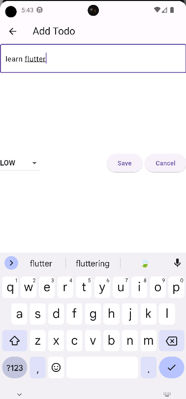
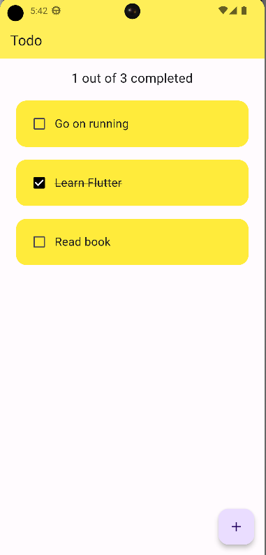

# Simple To-Do App Documentation

Welcome to the Simple To-Do App documentation! This app allows you to manage your tasks easily.

## Adding a New To-Do

To add a new to-do to your list, follow these steps:

1. Open the app.
2. Look for the Floating action button and click on it.
3. A text field will appear. Type in your new to-do task.
4. Press the "Add" button or hit Enter to add the task to your to-do list.

## Marking a To-Do as Completed

Once you've completed a task, you can mark it as completed:

1. Find the to-do you want to mark as completed in the list.
2. Next to the task, you'll see a checkbox or an option to mark it as completed.
3. Click the checkbox or select the option to mark the task as completed.

## Viewing Completed To-Dos

To view the number of completed to-dos out of the total, follow these steps:

1. Navigate to the main screen of the app.
2. You'll see a section that shows the count of completed to-dos.
3. The total number of completed to-dos and the total number of to-dos will be displayed.

## Important
1. Add functionality to priority of todos
2. make add todo screen Ui better 

## Screenshots

Here are some screenshots of the Simple To-Do App interface:

